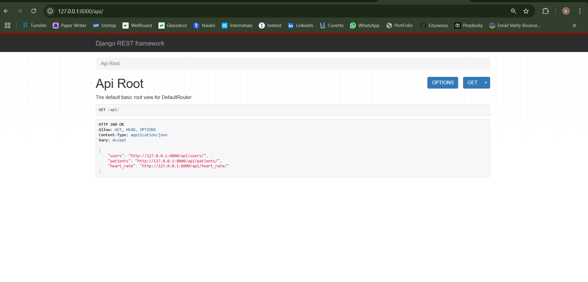
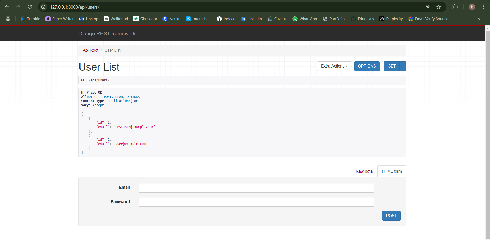
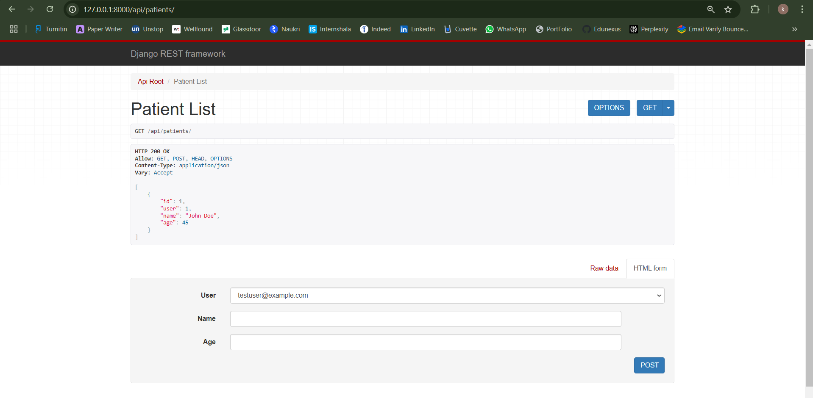
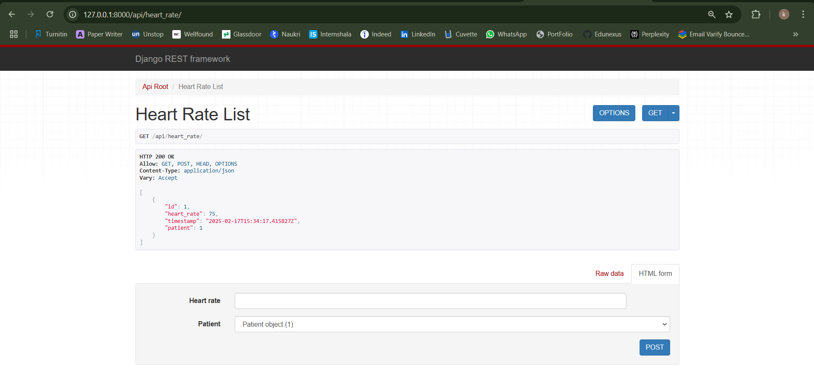

# Assignment

This is a Django project for managing and processing heart rate data. It uses **MySQL** as the database and **Django REST framework** for API endpoints. This README provides instructions on how to set up and run the project.

## Prerequisites

- Python 3.10 or higher
- MySQL
- Django 5.0.3 or higher
- Django REST framework
- `pip` (Python package installer)

## Setting Up the Project

### 1. Clone the Repository

Clone the project repository to your local machine:

```bash
git clone https://github.com/Kalparatna/Assignement_j.git
cd Assignement_j
```

### 2. Install Dependencies

Make sure you have all the required packages. First, create a virtual environment if you don't have one:

```bash
python -m venv venv
```

Activate the virtual environment:

- On **Windows**:
  ```bash
  .\venv\Scripts\activate
  ```

- On **Mac/Linux**:
  ```bash
  source venv/bin/activate
  ```

Install the necessary dependencies by running:

```bash
pip install -r requirements.txt
```

### 3. Set Up the .env File

To store sensitive settings (like database credentials), create a `.env` file in the **main project folder** (the same folder where `manage.py` is located). Here's an example of the required contents for `.env`:

```env
DB_NAME=your_database_name
DB_USER=your_database_user
DB_PASSWORD=your_database_password
DB_HOST=localhost
DB_PORT=3306

SECRET_KEY=your_secret_key
DEBUG=True
```

### 4. Configure Database

Make sure you have MySQL installed and running on your machine. Create a new database for the project with the name specified in `DB_NAME` in the `.env` file:

run this command before running server
```bash
python create_db.py
```

### 5. Apply Migrations

Run the following command to create the database tables defined in your Django models:

```bash
python manage.py makemigrations
python manage.py migrate
```

### 6. Create a Superuser (Optional)

To access the Django admin panel, create a superuser by running the following command:

```bash
python manage.py createsuperuser
```

You will be prompted to enter a username, email, and password for the superuser.

### 7. Run the Development Server

Start the Django development server by running:

```bash
python manage.py runserver
```

Once the server is running, you can access the application at `http://127.0.0.1:8000/`.

### 8. Access the Admin Panel (Optional)

To access the Django admin panel, navigate to:

```
http://127.0.0.1:8000/admin/
```

Log in using the superuser credentials you created earlier.

---

## Project Structure

Here's an overview of the project structure:

```
<Assignement_j>
│
├── heartrate/               
│   ├── __init__.py
│   ├── settings.py         
│   ├── urls.py               
│   ├── wsgi.py              
│
├── api/                      
│   ├── __init__.py
│   ├── views.py             
│   ├── serializers.py        
│   ├── urls.py             
│
├── manage.py               
├── requirements.txt        
└── .env                      
```

---

### 9. Result Images  
 
  
  
  
  


